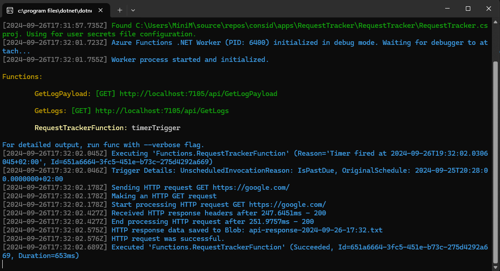
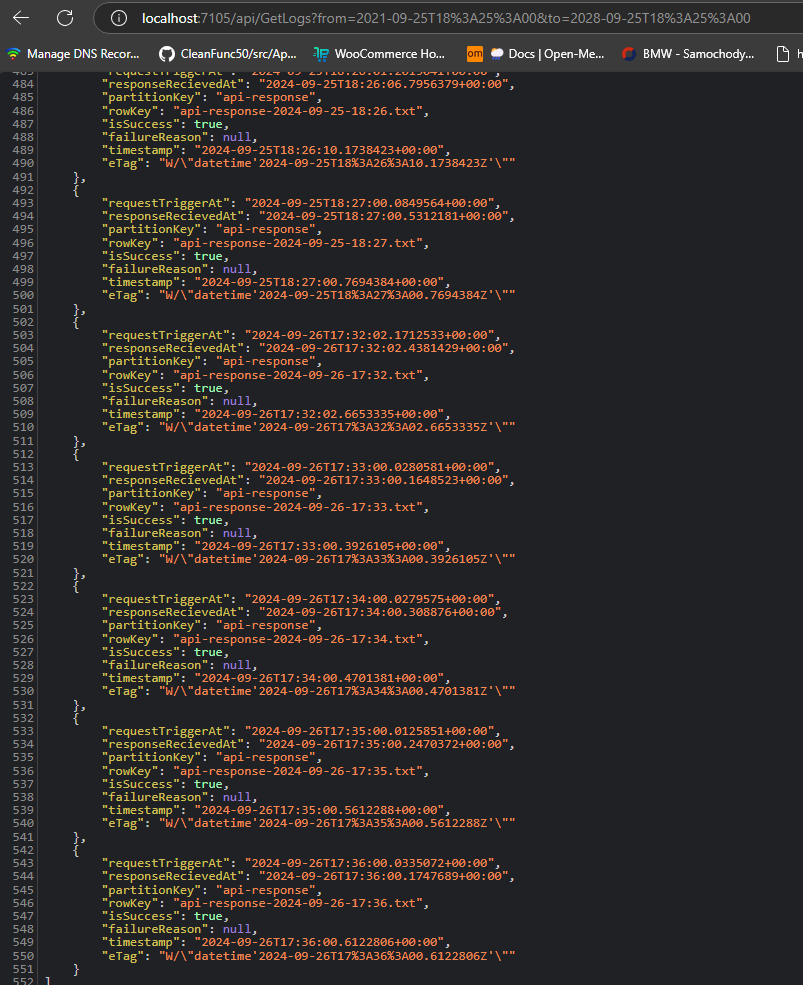
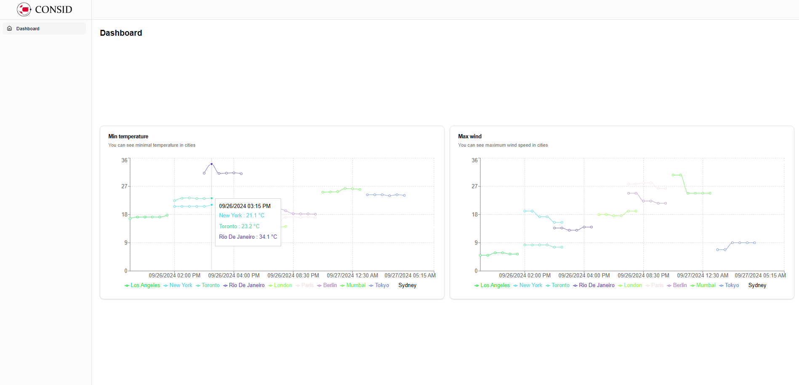
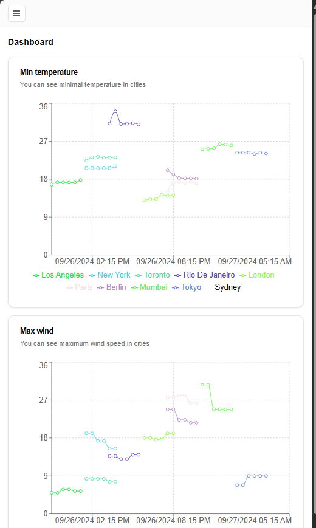

# README.md

## Project Overview

This project consists of two parts that focus on integrating Azure Functions with Azure Storage and building a system to fetch and store weather data. The primary objectives are to fetch data from public APIs at regular intervals, log and store this data efficiently, and provide mechanisms for retrieving and visualizing the information.

---

## Part 1: Azure Function & Storage Integration

### Description

In this part, an Azure Function is used to fetch random data from a public API every minute. Each attempt to fetch the data is logged, and successful data is stored for future retrieval. The logs of each fetch attempt, including success or failure, are stored in Azure Table Storage, while the full payload is stored in Azure Blob Storage.

Two main features are implemented:

1. **Data Fetching & Logging**: Logs every fetch attempt and stores successful payloads.
2. **Data Retrieval**: Ability to retrieve logs within a specific time frame and fetch stored payloads.

## Screens

---

## Part 2: Weather Data Fetching & Storage

### Description

This part focuses on fetching weather data for multiple cities across different countries. The weather information includes details such as temperature, cloud coverage, and wind speed. The data is updated every minute and stored in a database for future analysis and visualization.

Two graphical representations are created:

1. **Min Temperature Graph**: Displays the minimum temperatures along with city and country information.
2. **Max Wind Speed Graph**: Displays the cities with the highest wind speeds, including country information.

Additionally, stored procedures are implemented to analyze and filter weather data:

1. **Max Wind Speed by Country**: Provides the maximum wind speed in a given country.
2. **Min Temperature & Max Wind Speed Filter**: Filters weather data based on a temperature threshold to provide relevant information about wind speed and temperature in a country.

---

## Screens

---

## Technologies Used

- **Azure Functions** for serverless task execution.
- **Azure Table & Blob Storage** for storing logs and payloads.
- **.NET Core 6** for backend API implementation.
- **Public APIs** for fetching random data and weather information.
- **Database** SQL Server for storing and analyzing weather data.
- **Graphing Libraries** for visualizing temperature and wind speed data.
